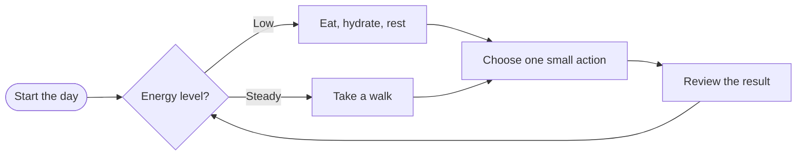
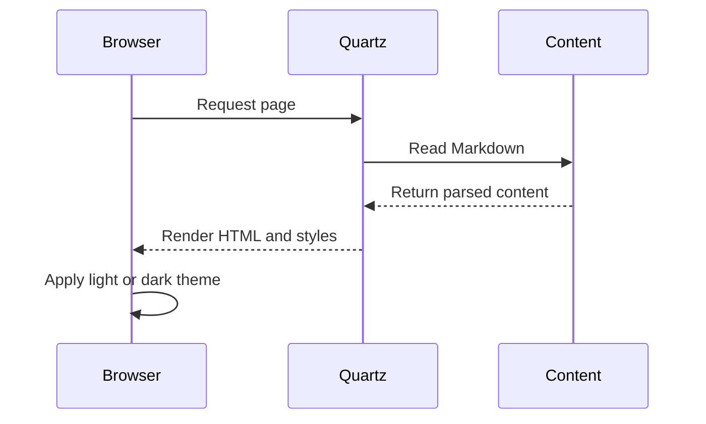

# Markdown Test Garden

This page is a deliberately busy test surface for typography, spacing, colors, responsive layouts, and content plugins. It contains examples of the Markdown features used across this site.

> [!info] Test page
> This note is content for development only. It can be edited or removed without affecting the rest of the site.

## Contents

- [Headings and inline text](#headings-and-inline-text)
- [Lists and task items](#lists-and-task-items)
- [Tables](#tables)
- [Callouts](#callouts)
- [Images and illustrations](#images-and-illustrations)
- [Diagrams](#diagrams)
- [Code and mathematics](#code-and-mathematics)
- [Links and embeds](#links-and-embeds)

---

## Headings and inline text

### A third-level heading

#### A fourth-level heading

##### A fifth-level heading

###### A sixth-level heading

This paragraph tests **bold text**, _italic text_, **_bold italic text_**, ~~strikethrough~~, ==highlighted text==, `inline code`, and a [normal external link](https://quartz.jzhao.xyz/).

Here is a line with a hard break  
and a second line immediately below it.

> A short quotation can test indentation, border treatment, line height, and long wrapping behavior. It should remain readable on a narrow screen.

## Lists and task items

### Unordered list

- First level item
  - Nested item with a longer sentence to test wrapping inside a list.
  - Another nested item
    - Third-level item
- Item with **strong emphasis**
- Item with a [link](https://example.com/)

### Ordered list

1. Observe the page at a wide viewport.
2. Resize the viewport to a phone width.
3. Toggle light and dark mode.
4. Check keyboard focus and link states.

### Task list

- [x] Render the page
- [x] Check headings and navigation
- [ ] Check the mobile layout
- [ ] Add a local asset if the page needs one

## Tables

| Feature  | Example                | Status | Notes                       |
| -------- | ---------------------- | :----: | --------------------------- |
| Headings | `#`, `##`, `###`       | Ready  | Check the table of contents |
| Callouts | `> [!info]`            | Ready  | Includes collapsed examples |
| Mermaid  | Flowchart and sequence | Ready  | Test overflow behavior      |
| Math     | Inline and display     | Ready  | Requires the LaTeX plugin   |
| Images   | Local and remote       | Ready  | Check captions and alt text |

### A wider table

| Morning      | Afternoon    | Evening          | Metric       | Sample value |
| ------------ | ------------ | ---------------- | ------------ | -----------: |
| Walk outside | Focused work | Read             | Energy       |         8/10 |
| Breakfast    | Short break  | Stretch          | Mood         |         7/10 |
| Water        | Deep work    | Prepare tomorrow | Sleep target |      8 hours |

## Callouts

> [!note] A note callout
> Notes should have a clear title and enough text to reveal the background, border, icon, and paragraph spacing.

> [!tip]+ An expanded tip
> This callout starts expanded. It also contains a nested list:
>
> - Keep the content scannable.
> - Use a short title.
> - Test the open and closed states.

> [!warning]- A collapsed warning
> This content starts hidden. The toggle should still be easy to discover and operate.

> [!success] Success
> The page has reached the next checkpoint.

> [!question] Question
> Does this callout remain comfortable to read on a small screen?

> [!danger] Danger
> This is intentionally high-salience content for testing contrast and spacing.

> [!quote] Quote
> "The important thing is to keep testing the thing you actually ship."

## Images and illustrations

### Local image


_A local asset from the content folder. The caption is ordinary italic Markdown text._

### Remote image


### Inline illustration

<svg class="test-illustration" viewBox="0 0 640 220" role="img" aria-labelledby="illustration-title illustration-desc" xmlns="http://www.w3.org/2000/svg">
  <title id="illustration-title">A simple illustrated health loop</title>
  <desc id="illustration-desc">Three colored circles labeled Move, Nourish, and Rest connected in a loop.</desc>
  <rect width="640" height="220" rx="18" fill="#eef5f3" />
  <path d="M182 110h86M372 110h86M500 76c18 10 28 22 28 34s-10 24-28 34" fill="none" stroke="#284b63" stroke-width="5" stroke-linecap="round" />
  <path d="m258 99 12 11-12 11M448 99l12 11-12 11M518 131l10 13-15 2" fill="none" stroke="#284b63" stroke-width="5" stroke-linecap="round" stroke-linejoin="round" />
  <circle cx="120" cy="110" r="62" fill="#84a59d" />
  <circle cx="330" cy="110" r="62" fill="#f2cc8f" />
  <circle cx="510" cy="110" r="62" fill="#e07a5f" />
  <g fill="#ffffff" text-anchor="middle" font-family="sans-serif" font-size="22" font-weight="700">
    <text x="120" y="118">Move</text>
    <text x="330" y="118">Nourish</text>
    <text x="510" y="118">Rest</text>
  </g>
</svg>

## Diagrams

### Mermaid flowchart



### Mermaid sequence diagram



## Code and mathematics

### Inline code

Use `npm run check` to validate TypeScript and formatting. Use `npx quartz build` to generate the site.

### JavaScript

```js title="A small sample function"
function clamp(value, minimum, maximum) {
  return Math.min(Math.max(value, minimum), maximum)
}

console.log(clamp(12, 0, 10))
```

### CSS

```css
.test-illustration {
  display: block;
  width: 100%;
  max-width: 40rem;
  margin: 1rem auto;
}
```

### Inline math

The familiar energy balance model is often written as $E_{in} - E_{out} = Delta E$.

### Display math

$$
\text{daily change} = \text{intake} - \text{expenditure}
$$

$$
f(x) = \frac{1}{1 + e^{-x}}
$$

## Links and embeds

- A local note: [[Understanding the Economics of Calories]]
- A section link: [[Understanding the Economics of Calories#Conclusion]]
- An external resource: [Quartz documentation](https://quartz.jzhao.xyz/)
- An email-shaped link: <hello@example.com>

### Footnote

This sentence has a footnote reference.[^test-note]

[^test-note]: Footnotes are useful for source notes and small asides.

### HTML details

<details>
<summary>Expandable HTML section</summary>

This is a native HTML disclosure element. It tests how raw HTML sits alongside Markdown content.

</details>

## Final checklist

> [!todo] Development checklist
>
> - [ ] Check the page title and metadata
> - [ ] Check the table of contents
> - [ ] Check images at multiple widths
> - [ ] Check callout toggles
> - [ ] Check Mermaid rendering
> - [ ] Check code block scrolling
> - [ ] Check dark mode contrast

---

_End of test page._
